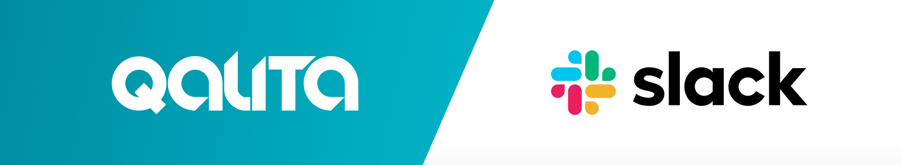

## Integration: Slack Alerts ← QALITA (Beta)

<p align="center">
  
</p>

**Goal:** send QALITA alerts to Slack channels for awareness and quick triage.

**Overview:**

1. QALITA triggers alerts when score thresholds are crossed or on issue lifecycle events.
2. A notifier sends a message via a Slack Incoming Webhook or a Slack App (Bot Token).
3. Messages contain direct links to issues, sources, and datasets in QALITA.

This integration is in beta.

**References:**

* Alerts: [https://doc.qalita.io/docs/platform/user-guides/alerts](https://doc.qalita.io/docs/platform/user-guides/alerts)
* Integrations (admin): [https://doc.qalita.io/docs/platform/user-guides/admin/integrations](https://doc.qalita.io/docs/platform/user-guides/admin/integrations)

---

### Prerequisites

* An administrator account on QALITA Platform.
* Admin rights on your Slack workspace.
* Outbound network allowed to `slack.com` and `hooks.slack.com`.
* Choose an integration method:

  * Slack Incoming Webhook (simple, one-way messages).
  * Slack App with Bot Token (richer messages, threads, interactivity).

---

### Method A — Slack Incoming Webhook (simple)

1. **Create a Webhook in Slack**

* Go to `https://api.slack.com/apps` > *Create New App* > *From scratch*.
* Under *Features > Incoming Webhooks*, enable "Incoming Webhooks".
* Click *Add New Webhook to Workspace*, choose the target channel, confirm.
* Copy the Webhook URL (looks like `https://hooks.slack.com/services/T000/B000/XXXXXXXX`).

2. **Configure QALITA**

* Open QALITA as administrator.
* Navigate to `Settings` > `Integration` > `Slack`.
* Paste the Webhook URL in the "Slack Webhook URL" field and save.
* Optional: set up routing rules (by severity, project) if available in your version.

3. **Quick test (via Slack directly)**

Run an HTTP request to the Webhook URL to validate delivery:

```bash
curl -X POST -H 'Content-type: application/json' \
  --data '{
    "text": ":rotating_light: Test QALITA → Slack (Webhook).
Channel OK, ready for alerts."
  }' \
  https://hooks.slack.com/services/…
```

4. **Example alert message (Webhook payload):**

```json
{
  "text": ":rotating_light: Quality drop on {source_name} — score {score_after}% (before {score_before}%).\nSee: <{alerts_url}|QALITA Alerts> • <{source_url}|Source> • <{pack_url}|Pack>"
}
```

---

### Method B — Slack App (Bot Token) for rich messages

1. **Create the app and set permissions**

* `https://api.slack.com/apps` > *Create New App* > *From scratch*.
* Under *OAuth & Permissions*, add at least these Bot scopes:

  * `chat:write`, `chat:write.public`
  * `channels:read`, `groups:read` (read public/private channels)
  * Add `commands`, `reactions:write`, `im:write` if planning interactions.
* Click *Install to Workspace* and copy the Bot User OAuth Token (`xoxb-…`).

2. **Get channel identifiers**

* In Slack, open the target channel > Details > About > Channel ID (e.g., `C0123ABCD`).
* For private channels, invite the bot (`/invite @YourBot`).

3. **Configure QALITA**

* Go to `Settings` > `Integration` > `Slack`.
* Enter the `Bot Token` (`xoxb-…`) and the default `Channel ID`.
* Optional: configure channel overrides by severity/project.

4. **Test via Slack API (chat.postMessage)**

```bash
curl -X POST https://slack.com/api/chat.postMessage \
  -H "Authorization: Bearer xoxb-…" \
  -H "Content-type: application/json; charset=utf-8" \
  --data '{
    "channel": "C0123ABCD",
    "text": ":white_check_mark: Test QALITA → Slack (Bot Token)",
    "unfurl_links": false,
    "unfurl_media": false
  }'
```

5. **Example Block Kit (rich message):**

```json
{
  "channel": "C0123ABCD",
  "blocks": [
    { "type": "header", "text": { "type": "plain_text", "text": "Quality Alert – {source_name}" } },
    { "type": "section", "text": { "type": "mrkdwn", "text": ":warning: Score {dimension}: *{score_after}%* (before {score_before}%)" } },
    { "type": "context", "elements": [
      { "type": "mrkdwn", "text": "Measured on {score_after_date}. Threshold: {threshold}%" }
    ]},
    { "type": "actions", "elements": [
      { "type": "button", "text": { "type": "plain_text", "text": "View Alerts" }, "url": "{alerts_url}" },
      { "type": "button", "text": { "type": "plain_text", "text": "View Source" }, "url": "{source_url}" },
      { "type": "button", "text": { "type": "plain_text", "text": "Pack" }, "url": "{pack_url}" }
    ]}
  ]
}
```

---

### Configuration in QALITA Platform

1. **Access the integration page**

* Log in as administrator.
* Go to `Settings` > `Integration` > *Messaging* tab > *Slack* card.

2. **Fields to fill (depending on method)**

* Method A (Webhook): `Slack Webhook URL`.
* Method B (App): `Bot Token` + default `Channel ID`.
* Optional: routing rules by severity/project if available.

3. **Save and test**

* Save the configuration.
* Trigger an alert (e.g., ingestion with score crossing a threshold) to validate.
* Otherwise, test directly via `curl` (examples above) to check Slack permissions.

---

### Typical alert triggers

* Quality score threshold crossed on a new measurement.
* Creation/assignment/update of a quality issue.
* Service reliability events (depending on configuration).

See the Alerts guide to configure thresholds and recipients.

---

### Useful variables in messages

* `{source_name}`, `{source_id}`, `{pack_name}`, `{pack_id}`, `{dimension}`
* `{score_before}`, `{score_before_date}`, `{score_after}`, `{score_after_date}`
* `{alerts_url}`, `{source_url}`, `{pack_url}` (based on your public QALITA URL)

Example URL: `https://<your-qalita-domain>/home/data-management/alerts`

---

### Troubleshooting

* **No message received:**

  * Webhook: check that Incoming Webhooks are enabled and URL not revoked.
  * Bot: is the bot invited to the private channel? Is the channel ID correct?
  * Network: ensure egress to `slack.com`/`hooks.slack.com` allowed by proxy/firewall.

* **Slack API error 403/400:**

  * Check scopes (`chat:write`, etc.), reinstall the app if modified.
  * Ensure `Content-type: application/json` and valid JSON (UTF-8).

* **Duplicate/out-of-order messages:**

  * Slack may retry delayed/dropped messages; add an idempotency key on sender side if needed.

* **Rate limits:**

  * Respect Slack rate limits; implement exponential backoff and bounded retries.

---

### Security and best practices

* Treat the `Webhook URL` and `Bot Token` as secrets: never commit them.
* Revoke/rotate secrets if exposure is suspected.
* Restrict target channels to what is strictly necessary and limit scope permissions.
* Regularly audit send logs and Slack app activity.

---

### Appendix — Quick test commands

* **Webhook (simple text):**

```bash
curl -X POST -H 'Content-type: application/json' \
  --data '{"text":"Ping from QALITA"}' \
  https://hooks.slack.com/services/…
```

* **Bot (simple text):**

```bash
curl -X POST https://slack.com/api/chat.postMessage \
  -H "Authorization: Bearer xoxb-…" \
  -H "Content-type: application/json" \
  --data '{"channel":"C0123ABCD","text":"Ping from QALITA"}'
```