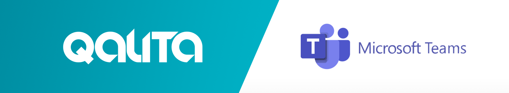

## Integration: Microsoft Teams Alerts ← QALITA (Beta)

<p align="center">
  
</p>

**Goal:** send QALITA alerts to Microsoft Teams channels for awareness and quick triage.

**Overview:**

1. QALITA triggers alerts when score thresholds are crossed or on issue lifecycle events.
2. A notifier sends a message to Teams via an Incoming Webhook or via Microsoft Graph/Bot.
3. Messages contain direct links to issues, sources, and datasets in QALITA.

This integration is in beta.

**References:**

* Alerts: [https://doc.qalita.io/docs/platform/user-guides/alerts](https://doc.qalita.io/docs/platform/user-guides/alerts)
* Integrations (admin): [https://doc.qalita.io/docs/platform/user-guides/admin/integrations](https://doc.qalita.io/docs/platform/user-guides/admin/integrations)

---

### Prerequisites

* An administrator account on QALITA Platform.
* Permission to add apps/connectors in the target Microsoft Teams team/channel.
* Outbound network access to Teams/Graph endpoints (for your tenant and region), e.g. `*.office.com`, `*.microsoft.com`, `teams.microsoft.com`, `webhook.office.com`, `graph.microsoft.com`.
* Choose an integration method:

  * Incoming Webhook (simple, one-way messages).
  * Microsoft Graph / Bot (richer messages, threads, and potential interactivity).

---

### Method A — Microsoft Teams Incoming Webhook (simple)

1. **Create an Incoming Webhook in Teams**

* In Microsoft Teams, open the target channel.
* Click the channel name ••• (More options) > Connectors. If you don't see Connectors, ask your Teams admin to enable them for your org/team.
* Find "Incoming Webhook" > Configure.
* Give it a name (e.g., "QALITA Alerts") and optionally upload a logo.
* Click Create and copy the Webhook URL (looks like `https://outlook.office.com/webhook/...` or `https://<region>.webhook.office.com/...`).

2. **Configure QALITA**

* Open QALITA as administrator.
* Navigate to `Settings` > `Integration` > `Microsoft Teams`.
* Paste the Incoming Webhook URL and save.
* Optional: set up routing rules (by severity, project) if available in your version.

3. **Quick test (via curl)**

Run an HTTP request to the Webhook URL to validate delivery:

```bash
curl -X POST -H 'Content-Type: application/json' \
  --data '{
    "text": "🚨 Test QALITA → Microsoft Teams (Incoming Webhook).\nChannel OK, ready for alerts."
  }' \
  https://<your-teams-incoming-webhook-url>
```

4. **Example alert messages (Webhook payloads)**

Simple text:

```json
{
  "text": "🚨 Quality drop on {source_name} — score {score_after}% (before {score_before}%).\nSee: {alerts_url} • {source_url} • {pack_url}"
}
```

Adaptive Card (richer message) via Incoming Webhook:

```json
{
  "type": "message",
  "attachments": [
    {
      "contentType": "application/vnd.microsoft.card.adaptive",
      "content": {
        "$schema": "https://adaptivecards.io/schemas/adaptive-card.json",
        "type": "AdaptiveCard",
        "version": "1.4",
        "body": [
          { "type": "TextBlock", "weight": "Bolder", "size": "Medium", "text": "Quality Alert – {source_name}" },
          { "type": "TextBlock", "wrap": true, "text": "⚠️ Score {dimension}: {score_after}% (before {score_before}%)." },
          { "type": "TextBlock", "isSubtle": true, "spacing": "Small", "wrap": true, "text": "Measured on {score_after_date}. Threshold: {threshold}%" }
        ],
        "actions": [
          { "type": "Action.OpenUrl", "title": "View Alerts", "url": "{alerts_url}" },
          { "type": "Action.OpenUrl", "title": "View Source", "url": "{source_url}" },
          { "type": "Action.OpenUrl", "title": "Pack", "url": "{pack_url}" }
        ]
      }
    }
  ]
}
```

To test, save the JSON above as `card.json` and run:

```bash
curl -X POST -H 'Content-Type: application/json' \
  --data @card.json \
  https://<your-teams-incoming-webhook-url>
```

---

### Method B — Microsoft Graph / Teams Bot (rich, proactive)

Use this when you need richer capabilities (threads, replies, potential actions) beyond what Incoming Webhooks offer. This requires Azure AD configuration and admin consent.

1. **Choose your approach**

* Graph API (Application permissions) to post channel messages.
* Azure Bot (Bot Framework) for advanced conversational features. (Not required for basic alerts.)

2. **App registration & permissions (Graph)**

* Azure Portal > Azure Active Directory > App registrations > New registration.
* Create a Client secret and note: `Tenant ID`, `Client ID`, `Client Secret`.
* API permissions > Add a permission > Microsoft Graph > Application permissions:

  * `ChannelMessage.Send` (post messages to channels)
  * `Group.Read.All` (read team/channels metadata)

* Click "Grant admin consent".

3. **Get Team and Channel IDs**

* In Teams, on the channel, click ••• > Get link to channel.
* From the link, extract `groupId` (Team ID) and `channelId` (Channel ID).

4. **Configure QALITA**

* Go to `Settings` > `Integration` > `Microsoft Teams`.
* Enter `Tenant ID`, `Client ID`, `Client Secret`, and default `Team ID` + `Channel ID`.
* Optional: configure overrides by severity/project.

5. **Test via Microsoft Graph (channel message)**

Acquire an application token for Microsoft Graph (Client Credentials flow), then:

```bash
curl -X POST https://graph.microsoft.com/v1.0/teams/{team-id}/channels/{channel-id}/messages \
  -H "Authorization: Bearer $GRAPH_TOKEN" \
  -H "Content-Type: application/json" \
  --data '{
    "subject": null,
    "body": { "contentType": "html", "content": "<b>Test QALITA → Teams (Graph)</b>" }
  }'
```

Adaptive Card via Microsoft Graph:

```json
{
  "body": { "contentType": "html", "content": "Quality Alert – {source_name}" },
  "attachments": [
    {
      "id": "1",
      "contentType": "application/vnd.microsoft.card.adaptive",
      "contentUrl": null,
      "content": "{\n  \"$schema\": \"https://adaptivecards.io/schemas/adaptive-card.json\",\n  \"type\": \"AdaptiveCard\",\n  \"version\": \"1.4\",\n  \"body\": [\n    { \"type\": \"TextBlock\", \"weight\": \"Bolder\", \"size\": \"Medium\", \"text\": \"Quality Alert – {source_name}\" },\n    { \"type\": \"TextBlock\", \"wrap\": true, \"text\": \"⚠️ Score {dimension}: {score_after}% (before {score_before}%).\" },\n    { \"type\": \"TextBlock\", \"isSubtle\": true, \"spacing\": \"Small\", \"wrap\": true, \"text\": \"Measured on {score_after_date}. Threshold: {threshold}%\" }\n  ],\n  \"actions\": [\n    { \"type\": \"Action.OpenUrl\", \"title\": \"View Alerts\", \"url\": \"{alerts_url}\" },\n    { \"type\": \"Action.OpenUrl\", \"title\": \"View Source\", \"url\": \"{source_url}\" },\n    { \"type\": \"Action.OpenUrl\", \"title\": \"Pack\", \"url\": \"{pack_url}\" }\n  ]\n}"
    }
  ]
}
```

Note: for Graph, the Adaptive Card JSON must be escaped and provided as a string in `attachments[].content`.

---

### Configuration in QALITA Platform

1. **Access the integration page**

* Log in as administrator.
* Go to `Settings` > `Integration` > `Messaging` tab > `Microsoft Teams` card.

2. **Fields to fill (depending on method)**

* Method A (Incoming Webhook): `Teams Webhook URL`.
* Method B (Graph/Bot): `Tenant ID`, `Client ID`, `Client Secret`, default `Team ID`, `Channel ID`.
* Optional: routing rules by severity/project if available.

3. **Save and test**

* Save the configuration.
* Trigger an alert (e.g., ingestion with score crossing a threshold) to validate.
* Otherwise, test directly via `curl` (examples above) to check permissions and connectivity.

---

### Typical alert triggers

* Quality score threshold crossed on a new measurement.
* Creation/assignment/update of a quality issue.
* Service reliability events (depending on configuration).

See the Alerts guide to configure thresholds and recipients.

---

### Useful variables in messages

* `{source_name}`, `{source_id}`, `{pack_name}`, `{pack_id}`, `{dimension}`
* `{score_before}`, `{score_before_date}`, `{score_after}`, `{score_after_date}`
* `{alerts_url}`, `{source_url}`, `{pack_url}` (based on your public QALITA URL)

Example URL: `https://<your-qalita-domain>/home/data-management/alerts`

---

### Troubleshooting

* **No message received (Incoming Webhook):**

  * Ensure the Webhook URL was not revoked; recreate if necessary.
  * Verify that Connectors are allowed for the team/channel by your admin.
  * Network: ensure egress to `webhook.office.com`/`outlook.office.com` allowed by proxy/firewall.

* **HTTP 400 from Webhook:**

  * Check JSON validity and `Content-Type: application/json`.
  * Ensure payload schema is supported (simple `text` or Adaptive Card via `attachments`).
  * Reduce Adaptive Card version if your tenant does not support the specified version (e.g., use `1.3`).

* **HTTP 401/403 (Graph):**

  * Confirm the app has `ChannelMessage.Send` and admin consent is granted.
  * Verify the token audience is `graph.microsoft.com` and not expired.
  * Check Team/Channel IDs and that the app is allowed in the tenant.

* **Duplicate/out-of-order messages:**

  * Teams may retry on transient failures; add an idempotency key on sender side.

* **Rate limits:**

  * Respect Teams/Graph rate limits; implement exponential backoff and bounded retries.

---

### Security and best practices

* Treat the `Teams Webhook URL` and any Azure AD secrets as sensitive; never commit them.
* Revoke/rotate secrets if exposure is suspected.
* Restrict scope/permissions to what is strictly necessary.
* Regularly audit send logs and app activity.

---

### Appendix — Quick test commands

* **Incoming Webhook (simple text):**

```bash
curl -X POST -H 'Content-Type: application/json' \
  --data '{"text":"Ping from QALITA"}' \
  https://<your-teams-incoming-webhook-url>
```

* **Incoming Webhook (Adaptive Card):**

```bash
cat > card.json << 'JSON'
{
  "type": "message",
  "attachments": [
    {
      "contentType": "application/vnd.microsoft.card.adaptive",
      "content": {
        "$schema": "https://adaptivecards.io/schemas/adaptive-card.json",
        "type": "AdaptiveCard",
        "version": "1.4",
        "body": [{ "type": "TextBlock", "text": "Ping from QALITA", "weight": "Bolder" }]
      }
    }
  ]
}
JSON
curl -X POST -H 'Content-Type: application/json' --data @card.json \
  https://<your-teams-incoming-webhook-url>
```
