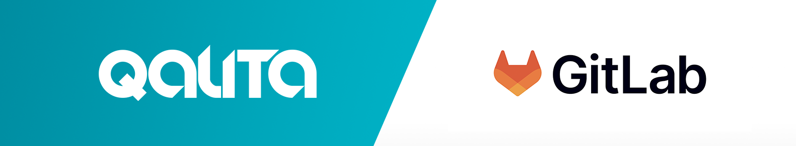

## Integration: GitLab Issues ↔ QALITA (Beta)

  

Goal: synchronize QALITA data quality issues with GitLab issues for triage and resolution.

High-level flow:

1. QALITA detects/updates an issue (from checks or metrics) and, if configured, creates/updates a corresponding GitLab issue.
2. GitLab webhooks notify QALITA of status/comments/assignee changes.
3. QALITA maintains a linkage and state sync between platforms.

Backend touchpoints:

- `app-backend/src/backend/routers/v2/` integration endpoints (e.g., `/integrations/gitlab/*`, `/issues/*`).
- `app-backend/src/backend/database/model/Issue.py` and related link tables for external references.
- Background jobs to retry API calls and rate-limit handling.

Implementation options:

- Configure a GitLab personal access token and project mapping in QALITA.
- Expose a webhook endpoint for GitLab (`/integrations/gitlab/webhook`).

Docs references:

- Issues UI and workflow: https://doc.qalita.io/docs/platform/user-guides/issues
- Admin integrations: https://doc.qalita.io/docs/platform/user-guides/admin/integrations

Next steps:

- Define field mapping (severity, labels, assignees)
- Idempotency and deduplication strategy
- Provide sample GitLab webhook configuration

