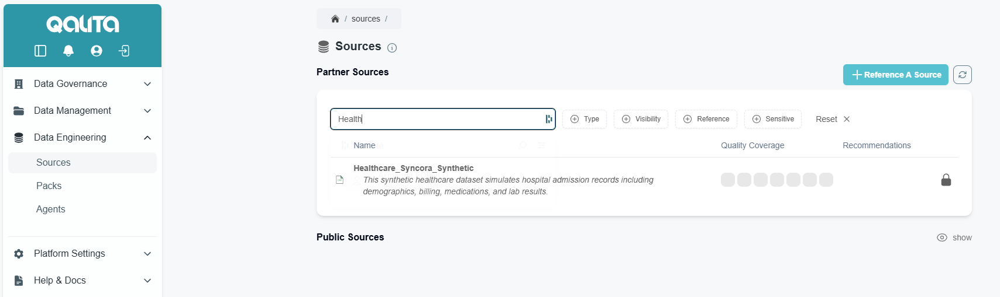

# Register a source

This tutorial will explain how to reference a new source to QALITA Platform.

Requirements :

* [Python (>3.12)](https://www.python.org/)
* [QALITA Platfrom Account](https://cloud.platform.qalita.io/signup)
* QALITA Agent deployed locally
  * [Deploy an agent locally on Windows](https://doc.qalita.io/docs/cli/quick-start)
  * [Deploy an agent locally on Linux/MacOS](https://doc.qalita.io/docs/cli/quick-start)
  * [Deploy an agent locally with Docker](https://doc.qalita.io/docs/cli/docker)

# 1. Fetch a source to be registered

First we need to download a dataset, for our tutorial we will download a synthetic dataset from [Hugging Face](https://huggingface.co/).

* 1.1 Download [healthcare admissions](https://huggingface.co/datasets/syncora/synthetic-healthcare-admissions/resolve/main/Healthcare_Syncora_Synthetic%201.csv?download=true)
* 1.2 Rename to `Healthcare_Syncora_Synthetic 1.csv`
* 1.3 Save it where you want

# 2.1 Register from Terminal commandline

* 2.1.1 Open your terminal
* 2.1.2 Make sure you are logged in `qalita agent login`
* 2.1.3 Type `qalita source add`
  * Source name = `Healthcare_Syncora_Synthetic`
  * Source Type = `file`
  * Source file path: *\<Your source file path>*
  * Source description = 
  ```
  This synthetic healthcare dataset simulates hospital admission records including demographics, billing, medications, and lab results.
  ```

* 2.1.4 : Finally publish your source with `qalita source push`
* 2.1.5 : Check if your source is correctly published in your platform cloud webapp in the page [Data Engineering] > [Sources]



# 2.2 Register from Agent GUI

* 2.2.1 Make sure you are logged in `qalita agent login`
* 2.2.2 Register the agent with UI `qalita --ui`
* 2.2.3 Go to the local ui : [http://localhost:7070](http://localhost:7070)
* 2.2.4 Click on [Add a source](http://localhost:7070/sources/add)
* 2.2.5 Select [File]
* 2.2.6 Add source informations 
* 
  * Source name = `Healthcare_Syncora_Synthetic`
  * Source description = 
  ```
  This synthetic healthcare dataset simulates hospital admission records including demographics, billing, medications, and lab results.
  ```
  * Source Type = `file`
  * Source file path: *\<Your source file path>*
* 2.2.7 Select [Validate]
* 2.2.8 Click on [Save]
* 2.1.5 : Check if your source is correctly published in your platform cloud webapp in the page [Data Engineering] > [Sources]

